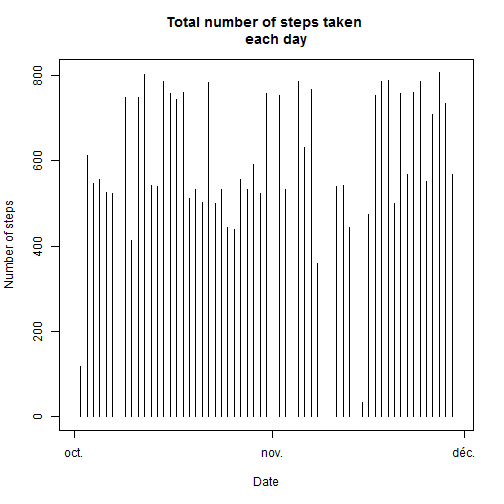
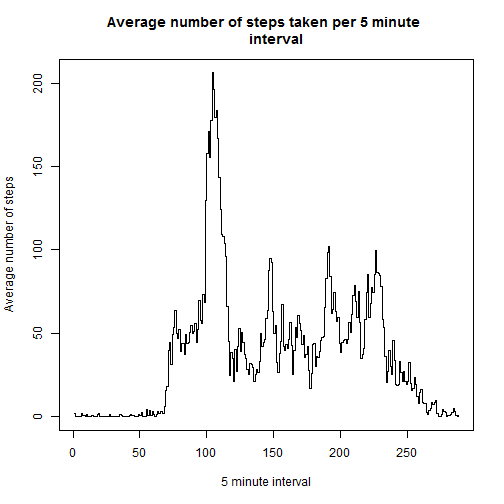
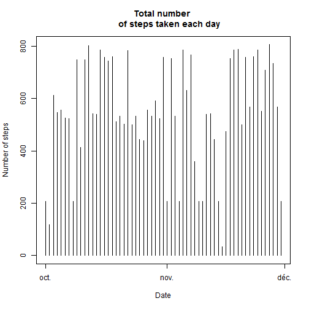

###Analysis of data from a personal activity monitoring device

The following is the result of analyses carried out on data obtained from a personal activity monitoring device. The analyses were conducted as requested in the Peer Assessment 1 of the Reproducible Research module offered as part of the Data Science Specialization on www.coursera.org.

**Loading and preprocessing the data**

First, we load the data from the activity.csv file which is located on the working directory


```r
data <- read.csv(file = "activity.csv", stringsAsFactors=FALSE, na.strings="NA")
```

Then we process the data to format the date column.


```r
data$date <- strptime(data$date, "%Y-%m-%d")
```

**What is mean total number of steps taken per day?**

1. We create a histogram of total number of steps taken each day.


```r
plot(data$date, data$steps, type = "h", main = "Total number of steps taken 
     each day", ylab = "Number of steps", xlab = "Date")
```

 

2. We then calculate the mean and median number of steps taken per day and return it in the text below.


```r
meansteps <- mean(data$steps, na.rm=TRUE)
mediansteps <- median(data$steps, na.rm=TRUE)
##The mean number of steps is `r meansteps` and the median number of steps is 
##`r mediansteps`. Please note that missing values have been ignored.
```

The mean number of steps is 37.3826 and the median number of steps is 0. Please note that missing values have been ignored.

**What is the average daily activity pattern?**

1. Firstly, we need to extract out the average number of steps taken for every 5 minute interval. Then we plot the output.


```r
DAP <- sapply(split(data$steps, data$interval), mean, na.rm=TRUE)
plot(DAP, type = "s", main = "Average number of steps taken per 5 minute 
     interval", ylab = "Average number of steps", xlab = "5 minute interval")
```

 

2. We then calculate the max 5 minute interval and return it in the text below


```r
maxDAP <- which(DAP == max(DAP))
##The 5-minute interval, on average across all the days in the dataset, which
##contains the maximum number of steps, is the `r maxDAP`th interval.
```

The 5-minute interval, on average across all the days in the dataset, which contains the maximum number of steps, is the 104th interval.

**Imputing missing values**

1. First, we calculate and report the total number of missing values in the dataset


```r
sumNA <- sum(is.na(data$steps))
## The total number of missing values in the dataset is `r sumNA`.
```

The total number of missing values in the dataset is 2304.

2. Here, we pass through the original dataset and create a new vector where NAs in the steps column are replaced with the mean number of steps taken per 5 minute interval


```r
totalrows <- nrow(data)
compDAP <- rep(DAP, 61) ## to create a vector equal in length to the dataset
newv <- vector()
id <- 1:totalrows
for (i in id) {
        ifelse (is.na(data$steps[i]), v <- compDAP[i], v <- data$steps[i])
        newv <- c(newv, v)
}
```

3. Create new dataframe with output from step 2.


```r
completedata <- data
completedata$steps <- newv
```

4. First, we make a histogram of the total number of steps taken each day and then we calculate and report the mean and median total number of steps taken per day in the text below.


```r
plot(completedata$date, completedata$steps, type = "h", main = "Total number 
     of steps taken each day", ylab = "Number of steps", xlab = "Date")
```

 

```r
meansteps2 <- mean(completedata$steps)
mediansteps2 <- median(completedata$steps)
##The mean number of steps taken each day is `r meansteps` and the median number 
##of steps is `r mediansteps`. Please note that missing values have been 
##replaced with the average value per 5 minute interval.
```

The mean number of steps taken each day is 37.3826 and the median number of steps is 0. Please note that missing values have been replaced with the average value per 5 minute interval.

Replacing missing values with the average value per 5 minute interval did not have an effect on the mean number of steps (as could be expected) and did not have an effect on the median number of steps. If the missing values were replaced by the median value, then a difference may be expected.

**Are there differences in activity patterns between weekdays and weekends?**

1. First, we install and load the timeDate package and then pass an sapply function which defines whether the date forms part of the weekday or of the weekend. Then replace TRUE with "weekend" and FALSE with "weekday" and add to the complete dataset.


```r
install.packages("timeDate", repos="http://cran.rstudio.com/")
```

```
## Installing package into 'C:/Users/mikoflan/Documents/R/win-library/3.1'
## (as 'lib' is unspecified)
```

```
## package 'timeDate' successfully unpacked and MD5 sums checked
## 
## The downloaded binary packages are in
## 	C:\Users\mikoflan\AppData\Local\Temp\RtmpQ3X17d\downloaded_packages
```

```r
library("timeDate")
```

```
## Warning: package 'timeDate' was built under R version 3.1.1
```

```r
time <- completedata$date
weekend <- sapply(as.Date(time), isWeekend)
weekend <- gsub("TRUE", "weekend", weekend)
weekend <- gsub("FALSE", "weekday", weekend)
completedata <- cbind(completedata, weekend)
```

2. Finally, create the required panel plot.


```r
library(lattice)
subsetdays <- subset(completedata, completedata$weekend == "weekday")
subsetwend <- subset(completedata, completedata$weekend == "weekend")
weekday <- sapply(split(subsetdays$steps, subsetdays$interval), mean)
weekend <- sapply(split(subsetwend$steps, subsetwend$interval), mean)
Interval <- names(weekday)
Interval <- as.integer(Interval)
stepswd <- as.numeric(weekday)
timewd <- c("weekday")
timewd <- rep(timewd, 288)
wddf <- data.frame(Interval, stepswd, timewd)
stepswe <- as.numeric(weekend)
timewe <- c("weekend")
timewe <- rep(timewe, 288)
wedf <- data.frame(Interval, stepswe, timewe)
colnames(wedf) <- c("Interval", "steps", "time")
colnames(wddf) <- c("Interval", "steps", "time")
alldata <- rbind(wddf, wedf)
xyplot(steps ~ Interval | time, data = alldata, type = "l", 
       layout = c(1, 2), ylab = "Number of steps")
```

 
